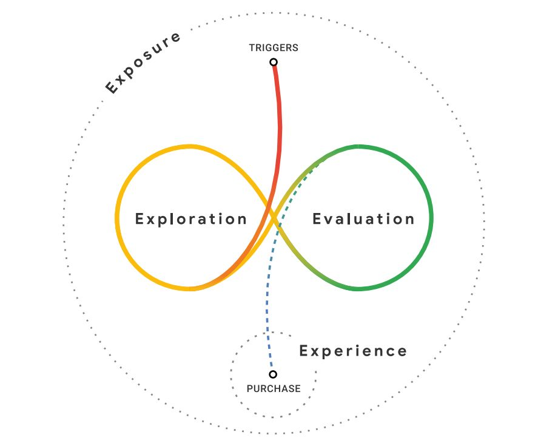

## NonLinear Interactive Video For Shopping Navigation
Code of paper 《Automatic Generation of Interactive Nonlinear Video for Online Apparel Shopping Navigation》.


**Notably, using interactive video to implement shopping navigation is a new research topic, and our solution is of course not perfect. Please refer to our failure cases and limitations before using this repo.**

## Update
- [2022-10-25] Update README, to introduce out work.
- [2022-10-19] Create the project, and upload main codes of this paper.

## Abstract

We present an automatic generation pipeline of interactive nonlinear video for online apparel shopping navigation. Our approach is inspired by Google’s "Messy Middle" theory, which suggests that people mentally have two tasks of exploration and evaluation before purchasing. Given a set of apparel product presentation videos, our navigation UI will organize these videos for users’ product exploration and automatically generate interactive videos for user product evaluation. To support automatic methods, we propose a video clustering similarity (CSIM) and a camera movement similarity (MSIM), as well as a comparative video generation algorithm for product recommendation, presentation, and comparison. To evaluate our pipeline’s effectiveness, we conducted several user studies. The results show that our pipeline can help users complete the consumption process more efficiently, making it easier for users to understand and choose the product.


## Theoretical support

# Messy Middle
<p align='center'>
    
</p>
Prior work has studied the behavioral logic of consumers and a "messy middle" theory was proposed, which noted that consumers often wander in the two states of exploration and evaluation when shopping online. Consumers explore their options and expand their consideration sets; then – either sequentially or simultaneously – they evaluate the options and narrow down their choices. Existing online shopping methods need to constantly switch pages to view and compare products. Such a shopping method reduces the exploration and evaluation efficiency and increases the time for customers to make a decision.

To shorten the shopping time between product exploration and decision-making, we propose an automatic approach for generating nonlinear videos into two-level, coarse-level exploration and fine-level evaluation, in support of online clothing shopping navigation. Our approach can automatically generate interactive nonlinear videos for product presentation and comparison based on consumers’ interactions.


## Preparation

# Requirements

``` bash
pip install requirements.txt
```

# Weights
- [AlphaPose]
- [Fashion]
- [Unet]
- [ML Models]

## Usage

# Exploration

``` bash
python examples/example_recommend.py
```

# Evaluation

``` bash
python 
```


