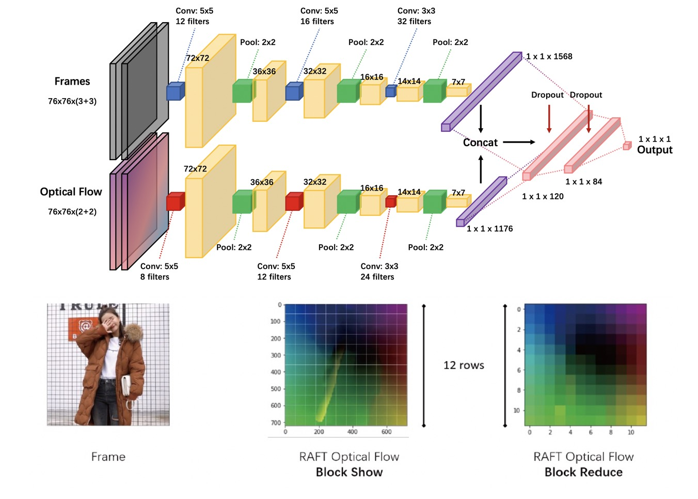

# NonLinear Interactive Video For Shopping Navigation
Code of paper 《Automatic Generation of Interactive Nonlinear Video for Online Apparel Shopping Navigation》.

<p align='center'>
    
</p>

**Notably, using interactive video to implement shopping navigation is a new research topic, and our solution is of course not perfect. Please refer to our failure cases and limitations before using this repo.**

## Update
- [2022-10-27] Add example files, in examples/.
- [2022-10-25] Update README, to introduce out work.
- [2022-10-19] Create the project, and upload main codes of this paper.

## Abstract

We present an automatic generation pipeline of interactive nonlinear video for online apparel shopping navigation. Our approach is inspired by Google’s "Messy Middle" theory, which suggests that people mentally have two tasks of exploration and evaluation before purchasing. Given a set of apparel product presentation videos, our navigation UI will organize these videos for users’ product exploration and automatically generate interactive videos for user product evaluation. To support automatic methods, we propose a video clustering similarity (CSIM) and a camera movement similarity (MSIM), as well as a comparative video generation algorithm for product recommendation, presentation, and comparison. To evaluate our pipeline’s effectiveness, we conducted several user studies. The results show that our pipeline can help users complete the consumption process more efficiently, making it easier for users to understand and choose the product.


## Theoretical support —— Messy Middle
<p align='center'>
    
</p>
    Prior work has studied the behavioral logic of consumers and a "messy middle" theory was proposed, which noted that consumers often wander in the two states of exploration and evaluation when shopping online. Consumers explore their options and expand their consideration sets; then – either sequentially or simultaneously – they evaluate the options and narrow down their choices. Existing online shopping methods need to constantly switch pages to view and compare products. Such a shopping method reduces the exploration and evaluation efficiency and increases the time for customers to make a decision.

    To shorten the shopping time between product exploration and decision-making, we propose an automatic approach for generating nonlinear videos into two-level, coarse-level exploration and fine-level evaluation, in support of online clothing shopping navigation. Our approach can automatically generate interactive nonlinear videos for product presentation and comparison based on consumers’ interactions.


## Requirements

``` bash
pip install requirements.txt
```

## Weights

- [\[Attribute and Category\]](https://drive.google.com/drive/folders/1vfO2GXi0wsJQ6zvPRSKOIMYLLAAvncuG?usp=sharing) Put in libs/Fashion/checkpoints/, to predict the attributes and categories of apparel products in videos.
- [\[Unet\]](https://drive.google.com/drive/folders/1lssxarbbnPggT94pEnwqnVPSGpNdFAo1?usp=sharing) Put in libs/unet_segmentation/, to segment the apparel products in videos.
- [\[Detail Classification\]](https://drive.google.com/drive/folders/1QgcrP0ZMKDTb8A2tHxonM_3mys-jkMVO?usp=sharing) Put in libs/Detail/models/, to classify the detail shots.
- [\[Landmark\]](https://drive.google.com/drive/folders/1BI7GLUjwdPguVpxneGPQK8dnPXkM_sBi?usp=sharing) Put in libs/Landmark/models/, to predict the clothing landmarks in full-shots.
- [\[MaskROI\]](https://drive.google.com/drive/folders/1WPAnizJJ_tfr1Q5uESxzy3a_L0HPdK-B?usp=sharing) Put in libs/maskRoi/weights/, to predict the ROI of human in frames.
- [\[AlphaPose\]](https://drive.google.com/drive/folders/1Fi_jvlc3kZUwwi6d6xikgd9ZGePTpYEh?usp=sharing) Put in libs/AlphaPose/models/, to detect the keypoints of people in frames.
- [\[ML Models\]](https://drive.google.com/drive/folders/1SZ3kZFp6NJGVMQkpYnc1Y_YcEjuRHqQu?usp=sharing) Put in model/, to obtain advantage features, such as view, direction of people in frame.

## Usage - Video Association Algorithm

In the video association algorithm, we sample the input product video at intervals of $t$ frames and extract the feature $F=\{F^{cate}, F^{attr}, F^{color}\}$. We construct a graph through the average of all features $F$ and use this graph to show the associations of categories, attributes, and colors between clothing products. Video association algorithms can be divided into feature extraction and graph construction.

<p align='center'>
    
</p>

To recommend similar products (in many product videos), you can use this command:

``` bash
python examples/example_recommend.py
```

It may takes long time to extract features and build the products' graph. After calculating all features of all videos, we will save them in a .pickle file. If there are lots of video nodes, it will also take a lot of space to save the graph.


## Usage - Shot Association Algorithm

In the shot association algorithm, we automatically attach detail shots to the full shot. When consumers evaluate the product, they can click the area of interest in the video to obtain more targeted information. The algorithm can be divided into video shot classification, detailed shot classification, and keypoint detection.

<p align='center'>
    
</p>


To associate close-up shots and full-shot, you can use this command:

``` bash
python examples/example_single_presentation.py
```

This example will only generate the keypoints' position in the full-shot, and the classification results of close-up. These results will be saved as a .yaml file. Through our player, we can play this .yaml file as an interactive video.


## Usage - Comparative Video Generation Algorith

The comparison algorithm we propose is designed to help consumers compare multiple interested products simultaneously. When comparing products, consumers can select the view (such as whole, medium, close-up) and direction (such as left, right, front, back) of the clothing in the video. Based on shots filtered by these tags, we train a neural network to generate a comparative video according to the optical flow features of camera movement. The comparative video generation algorithm can be divided into shot label extraction, optical flow feature calculation, and shot sequence generation.

<p align='center'>
    
</p>

To generate comparative shot sequence, you can use this command:

``` bash
cd examples/example_compare/
jupyter notebook
```

We prepare four examples in the folder.

- [\[example_raft.ipynb\]](examples/example_compare/example_raft.ipynb): The example of using raft to get optical features.

- [\[example_optical_flow.ipynb\]](examples/example_compare/example_optical_flow.ipynb): The example of using opencv to get optical features.

- [\[example_train_editor.ipynb\]](examples/example_compare/example_train_editor.ipynb): The example of training our DCDP-CNN.

- [\[example_cut_editor.ipynb\]](examples/example_compare/example_cut_editor.ipynb): The example of using DCDP-CNN to generate shot sequences.

## What's More

We also provide many tools and examples, to help you use any unit of our methods, such as alphapose, yolo, clothing segmentation, clothing landmarks detection.

In `examples/` and `tools/`, we hope you can find useful code for your work.